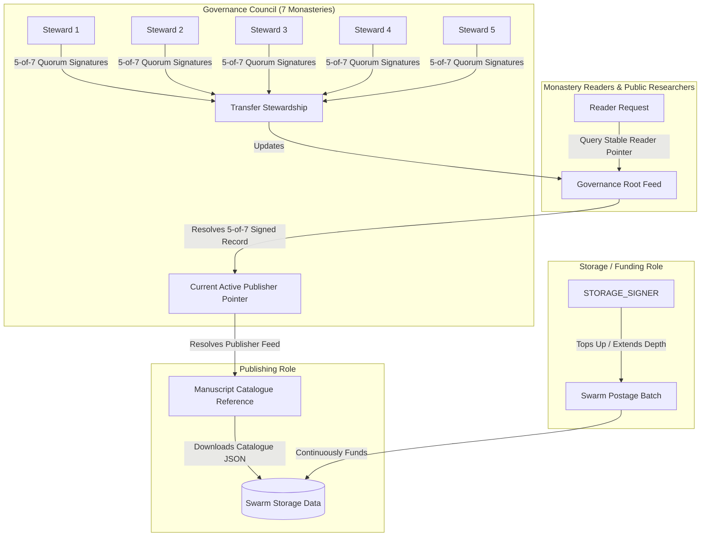
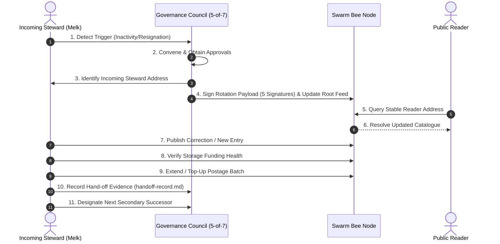

# Manuscript Catalogue System — "The succession nobody wrote down"

Decentralized manuscript catalogue governance, continuous postage batch storage funding, and multi-steward succession system for seven monastery libraries built on **Swarm** using **`@ethersphere/bee-js` v13**.

---

## 📌 Architecture Overview

The system provides a decentralized manuscript catalogue shared by seven monastery libraries (St. Gall, Melk, Mont Saint-Michel, Reichenau, Fulda, Lorch, Corbie) that remains:
- **Readable** even after the original steward stops participating.
- **Continuously funded** on Swarm via managed postage batches.
- **Correctable** by the active designated steward.
- **Transferable** to a successor under 7-steward multi-signature governance (**5-of-7 quorum**).
- **Independent** of individual publisher signing keys.



---

## 🔐 Identity & Role Separation

The architecture enforces strict separation between three distinct operational identities:

| Role | Key Config | Primary Responsibility | Key Restrictions |
|---|---|---|---|
| **Storage / Payment Identity** | `STORAGE_SIGNER_PRIVATE_KEY` | Pays for postage stamps, tops up BZZ balance, extends batch depth. | **Cannot** sign catalogue updates or modify governance pointers. |
| **Publishing Identity** | `PUBLISHER_SIGNER_PRIVATE_KEY` | Signs and uploads catalogue updates (folio descriptions, condition status, photography flags). | **Cannot** unilaterally transfer publishing authority or alter governance pointer. |
| **Governance Authority** | `GOVERNANCE_STEWARD_1_KEY` .. `7_KEY` | Represents the 7 monastery libraries. Authorizes publisher rotation via **5-of-7 multi-signature quorum**. | Maintains the stable reader pointer. |

---

## ⚠️ Shared Bee Node Storage Custody Policy & Security

> [!IMPORTANT]
> **Operational Realities of Shared Node Infrastructure:**
> - **Local Host Binding**: The Bee API interface normally binds strictly to `127.0.0.1` on the host machine running the Bee node.
> - **Local Execution**: Node-touching operations (such as stamp creation, batch top-ups, and chunk uploads) execute directly against this local Bee node instance.
> - **Custody Concentration**: When all seven institutions share a single Bee node for hosting, all postage batches belong to that node's internal wallet identity (`STORAGE_SIGNER`). Therefore, **storage custody is not independently separated** at the infrastructure layer.
> - **Network Exposure Risk**: Opening the Bee API to `0.0.0.0` allows external devices on the network to access node endpoints. This can enable unauthorized external parties to spend postage stamps or deplete node BZZ balances, and **must not be done casually**.
>
> **Cryptographic Security Safeguard**:
> Even though storage custody is shared on node, **Publishing Authority (`PUBLISHER_SIGNER`)** and **Governance Authority (`GOVERNANCE_STEWARDS`)** are maintained completely off-node using separate private keys. A compromise of the shared node host **cannot** forge manuscript catalogue entries or alter the 5-of-7 governance reader pointer.

---

## 🎯 Stable Reader Resolution

To prevent link breakage when stewards change:
1. Readers query a **Static Reader Address** (`Governance Root Feed Topic` + `Governance Root Identity`).
2. The Governance Root Feed returns the **Active Publisher Record**, verified by 5-of-7 steward signatures.
3. The reader fetches the latest manuscript catalogue payload from the active publisher's feed on Swarm.

When stewardship rotates from Steward 1 to Steward 2:
- The Governance Council publishes an updated signed pointer to the Governance Root Feed.
- **The reader's entry point address NEVER changes.**

---

## 📋 Operational Procedure: What to Do If the Current Steward Disappears

This procedure outlines the exact 11 operational steps a future steward must follow if the current primary publisher becomes inactive or unavailable:



### Step-by-Step Execution Guide:

1. **Detect Trigger Condition**: Confirm that a valid succession trigger has occurred (e.g. 30 days of publisher inactivity, notice of resignation, or institutional disruption).
2. **Convene & Obtain Steward Approvals**: Contact the delegates of the 7 monastery libraries and request authorization.
3. **Identify Incoming Steward**: Obtain the public Ethereum address of the incoming steward (`INCOMING_STEWARD_PRIVATE_KEY` / address parameter).
4. **Change Publisher Authority**: Execute the stewardship transfer script specifying the incoming steward address and collecting at least 5 steward signatures:
   ```bash
   INCOMING_STEWARD_PRIVATE_KEY=<incoming-key> npm run perform:handoff
   ```
5. **Verify Stable Reader Address**: Confirm that reader queries to `GOVERNANCE_FEED_TOPIC` point to the new publisher address.
6. **Verify Catalogue Contents**: Resolve and deserialize the catalogue payload using `FeedService.resolveCatalogueFromStablePointer`.
7. **Publish a Correction**: The new publisher publishes an updated catalogue record using their publishing key.
8. **Verify Storage Funding**: Inspect postage batch TTL and balance via `PostageBatchManager.inspectCatalogueBatch`.
9. **Extend / Top-Up Postage Batch**: If balance or depth is low, run:
   ```bash
   npm run top-up-batch
   ```
10. **Record the Hand-off**: Verify that `docs/handoff-record.md` contains the new cryptographic signatures and proposal hash, then run:
    ```bash
    npm run verify:handoff
    ```
11. **Prepare Next Succession**: Convene the Governance Council within 30 days to designate the next secondary successor.

---

## 📦 Swarm Storage Model & Postage Funding

All catalogue data and governance payload snapshots are uploaded to the **Swarm** network as Single Owner Chunks (SOCs) and Content-Addressed Chunks.

### Why Continued Funding is Required
Swarm requires continuous storage funding via **Postage Batches** (Stamps). Unfunded or depleted batches risk chunk garbage collection by storage nodes.
- **Top-Up (`topUpBatch`)**: Increases the BZZ balance to prolong batch TTL.
- **Extend Depth (`extendBatch` / `dilute`)**: Increases the storage depth capacity ($2^{\text{depth}}$ chunks).

---

## 🚀 Local Setup & Installation

### Prerequisites
- Node.js >= 18
- npm >= 9
- (Optional) Local Bee node running at `http://localhost:1633` (the test suite includes deterministic offline fallback).

### Installation

```bash
# Clone and install dependencies
git clone https://github.com/nikitabiradar231/swarm-steward-succession.git
cd swarm-steward-succession
npm install
```

### Environment Variables

Copy `.env.example` to `.env`:

```bash
cp .env.example .env
```

Environment variable configuration:

```ini
# Swarm Bee Node Endpoint
BEE_API_URL=http://localhost:1633
BEE_POSTAGE_BATCH_ID=fc0d88fabd3ca06e3b8992e07aadaf1b5c00ebd632acf86aa19bb0cf19206a7e

# Storage / Payment Identity (Bursar)
STORAGE_SIGNER_PRIVATE_KEY=0x1111111111111111111111111111111111111111111111111111111111111111

# Active Publishing Identity
PUBLISHER_SIGNER_PRIVATE_KEY=0x2222222222222222222222222222222222222222222222222222222222222222

# 7 Monastery Governance Stewards
GOVERNANCE_STEWARD_1_KEY=0x3333333333333333333333333333333333333333333333333333333333333333
GOVERNANCE_STEWARD_2_KEY=0x4444444444444444444444444444444444444444444444444444444444444444
GOVERNANCE_STEWARD_3_KEY=0x5555555555555555555555555555555555555555555555555555555555555555
GOVERNANCE_STEWARD_4_KEY=0x6666666666666666666666666666666666666666666666666666666666666666
GOVERNANCE_STEWARD_5_KEY=0x7777777777777777777777777777777777777777777777777777777777777777
GOVERNANCE_STEWARD_6_KEY=0x8888888888888888888888888888888888888888888888888888888888888888
GOVERNANCE_STEWARD_7_KEY=0x9999999999999999999999999999999999999999999999999999999999999999

# Stable Governance Pointer Topic
GOVERNANCE_FEED_TOPIC=monastery-catalogue-root
```

---

## 🛠️ Usage & Executable Commands

### 1. Compile TypeScript

```bash
npm run build
```

### 2. Run Automated Test Suite (All 8 Acceptance Tests)

```bash
npm test
```

### 3. Perform a Demo Stewardship Hand-Off

Executes a full succession flow: collects 5-of-7 steward governance signatures, updates the Swarm governance feed, and writes the tracked hand-off record artifact to `docs/handoff-record.md`.

```bash
npm run demo:handoff
```

### 4. Verify a Handoff Record

Verifies the cryptographic signatures and identity separation in `docs/handoff-record.md`:

```bash
npm run verify:handoff
```

### 5. Inspect & Top-Up Postage Batch

Callable CLI tool to inspect postage batch health and execute top-up / depth extension using `STORAGE_SIGNER`:

```bash
npm run top-up-batch
```

---

## 📜 Human Governance & Legal Artifacts

- [`docs/stewardship-agreement.md`](file:///c:/Users/nikita/OneDrive/Desktop/D3/docs/stewardship-agreement.md): Human-readable stewardship agreement for monastery committees detailing roles, triggers, shared custody limitations, and 5-of-7 governance rules.
- [`docs/handoff-record.md`](file:///c:/Users/nikita/OneDrive/Desktop/D3/docs/handoff-record.md): Tracked artifact recording completed stewardship succession with verifiable cryptographic evidence.

---

## 🛡️ Security & Confidentiality Policy

1. **Zero Hardcoded Credentials**: All keys and connection parameters are loaded from environment variables (`.env`).
2. **Identity Separation Safeguards**: The system enforces runtime assertions ensuring `STORAGE_SIGNER` address $\neq$ `PUBLISHER_SIGNER` address.
3. **No Unilateral Control**: The publisher key alone cannot alter the governance pointer without securing signatures from at least 5 out of 7 governance stewards.
4. **Git Protection**: `.gitignore` excludes `.env`, credential files, build outputs, and temporary files. Private keys are never committed.
