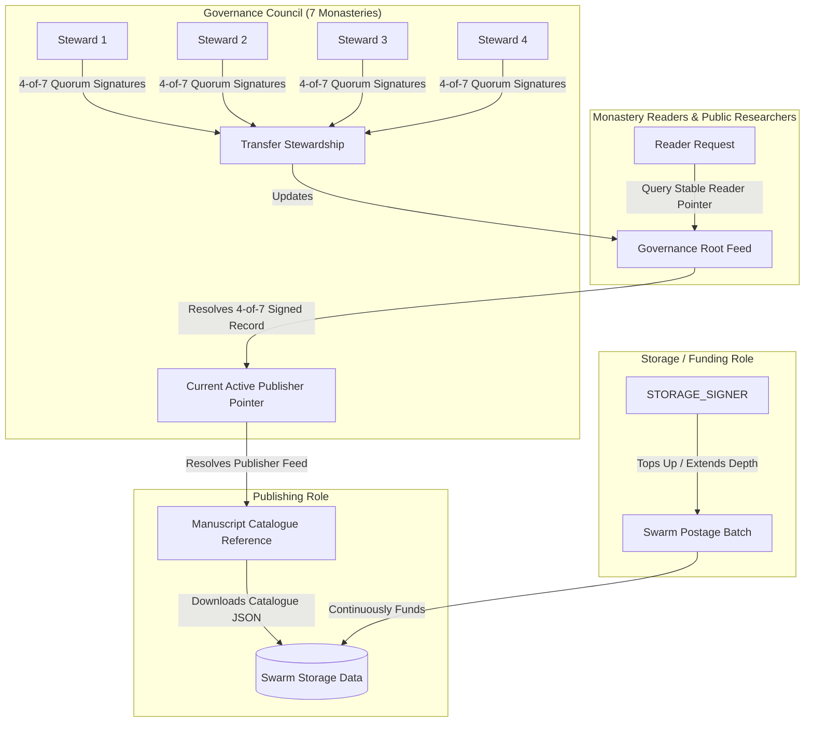

# Manuscript Catalogue System — "The succession nobody wrote down"

Decentralized manuscript catalogue governance, continuous postage batch storage funding, and multi-steward succession system for seven monastery libraries built on **Swarm** using **`@ethersphere/bee-js` v13**.

---

## 📌 Architecture Overview

The system provides a decentralized manuscript catalogue shared by seven monastery libraries (St. Gall, Melk, Mont Saint-Michel, Reichenau, Fulda, Lorch, Corbie) that remains:
- **Readable** even after the original steward stops participating.
- **Continuously funded** on Swarm via managed postage batches.
- **Correctable** by the active designated steward.
- **Transferable** to a successor under 7-steward multi-signature governance.
- **Independent** of individual publisher signing keys.



---

## 🔐 Identity & Role Separation

The architecture enforces strict separation between three distinct operational identities:

| Role | Key Config | Primary Responsibility | Key Restrictions |
|---|---|---|---|
| **Storage / Payment Identity** | `STORAGE_SIGNER_PRIVATE_KEY` | Pays for postage stamps, tops up BZZ balance, extends batch depth. | **Cannot** sign catalogue updates or modify governance pointers. |
| **Publishing Identity** | `PUBLISHER_SIGNER_PRIVATE_KEY` | Signs and uploads catalogue updates (folio descriptions, condition status, photography flags). | **Cannot** unilaterally transfer publishing authority or alter governance pointer. |
| **Governance Authority** | `GOVERNANCE_STEWARD_1_KEY` .. `7_KEY` | Represents the 7 monastery libraries. Authorizes publisher rotation via **4-of-7 multi-signature quorum**. | Maintains the stable reader pointer. |

---

## 🎯 Stable Reader Resolution

To prevent link breakage when stewards change:
1. Readers query a **Static Reader Address** (`Governance Root Feed Topic` + `Governance Root Identity`).
2. The Governance Root Feed returns the **Active Publisher Record**, verified by 4-of-7 steward signatures.
3. The reader fetches the latest manuscript catalogue payload from the active publisher's feed on Swarm.

When stewardship rotates from Steward 1 to Steward 2:
- The Governance Council publishes an updated signed pointer to the Governance Root Feed.
- **The reader's entry point address NEVER changes.**

---

## 📦 Swarm Storage Model & Postage Funding

All catalogue data and governance payload snapshots are uploaded to the **Swarm** network as Single Owner Chunks (SOCs) and Content-Addressed Chunks.

### Why Continued Funding is Required
Swarm requires continuous storage funding via **Postage Batches** (Stamps). Unfunded or depleted batches risk chunk garbage collection by storage nodes.
- **Top-Up (`topUpBatch`)**: Increases the BZZ balance to prolong batch TTL.
- **Extend Depth (`extendBatch` / `dilute`)**: Increases the storage depth capacity ($2^{\text{depth}}$ chunks).

---

## 🚀 Local Setup & Installation

### Prerequisites
- Node.js >= 18
- npm >= 9
- (Optional) Local Bee node running at `http://localhost:1633` (the test suite includes deterministic offline fallback).

### Installation

```bash
# Clone and install dependencies
git clone https://github.com/monastery-catalogue/succession.git
cd succession
npm install
```

### Environment Variables

Copy `.env.example` to `.env`:

```bash
cp .env.example .env
```

Environment variable configuration:

```ini
# Swarm Bee Node Endpoint
BEE_API_URL=http://localhost:1633
BEE_POSTAGE_BATCH_ID=0000000000000000000000000000000000000000000000000000000000000000

# Storage / Payment Identity (Bursar)
STORAGE_SIGNER_PRIVATE_KEY=0x1111111111111111111111111111111111111111111111111111111111111111

# Active Publishing Identity
PUBLISHER_SIGNER_PRIVATE_KEY=0x2222222222222222222222222222222222222222222222222222222222222222

# 7 Monastery Governance Stewards
GOVERNANCE_STEWARD_1_KEY=0x3333333333333333333333333333333333333333333333333333333333333333
GOVERNANCE_STEWARD_2_KEY=0x4444444444444444444444444444444444444444444444444444444444444444
GOVERNANCE_STEWARD_3_KEY=0x5555555555555555555555555555555555555555555555555555555555555555
GOVERNANCE_STEWARD_4_KEY=0x6666666666666666666666666666666666666666666666666666666666666666
GOVERNANCE_STEWARD_5_KEY=0x7777777777777777777777777777777777777777777777777777777777777777
GOVERNANCE_STEWARD_6_KEY=0x8888888888888888888888888888888888888888888888888888888888888888
GOVERNANCE_STEWARD_7_KEY=0x9999999999999999999999999999999999999999999999999999999999999999

# Stable Governance Pointer Topic
GOVERNANCE_FEED_TOPIC=monastery-catalogue-root
```

---

## 🛠️ Usage & Executable Commands

### 1. Compile TypeScript

```bash
npm run build
```

### 2. Run Automated Test Suite (All 8 Acceptance Tests)

```bash
npm test
```

### 3. Perform a Demo Stewardship Hand-Off

Executes a full succession flow: collects 4-of-7 steward governance signatures, updates the Swarm governance feed, and writes the tracked hand-off record artifact to `docs/handoff-record.md`.

```bash
npm run demo:handoff
```

### 4. Verify a Handoff Record

Verifies the cryptographic signatures and identity separation in `docs/handoff-record.md`:

```bash
npm run verify:handoff
```

### 5. Inspect & Top-Up Postage Batch

Callable CLI tool to inspect postage batch health and execute top-up / depth extension using `STORAGE_SIGNER`:

```bash
npm run top-up-batch
```

---

## 📜 Human Governance & Legal Artifacts

- [`docs/stewardship-agreement.md`](file:///c:/Users/nikita/OneDrive/Desktop/D3/docs/stewardship-agreement.md): Human-readable stewardship agreement for monastery committees detailing roles, triggers, and 4-of-7 governance rules.
- [`docs/handoff-record.md`](file:///c:/Users/nikita/OneDrive/Desktop/D3/docs/handoff-record.md): Tracked artifact recording completed stewardship succession with verifiable cryptographic evidence.

---

## 🛡️ Security Considerations

1. **Zero Hardcoded Credentials**: All keys and connection parameters are loaded from environment variables (`.env`).
2. **Identity Separation Safeguards**: The system enforces runtime assertions ensuring `STORAGE_SIGNER` address $\neq$ `PUBLISHER_SIGNER` address.
3. **No Unilateral Control**: The publisher key alone cannot alter the governance pointer without securing signatures from at least 4 out of 7 governance stewards.
